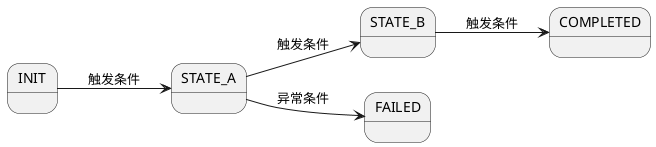
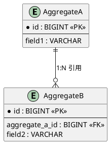

# Feature: {F-ID}-{short-name}

> 元信息（由 clarify 自动填写）
> - Feature ID: F{NNN}-{short-name}
> - 优先级: P0/P1/P2
> - 涉及领域: {domain1}, {domain2}
> - 状态: draft / approved / goal-running / done

## 问题定义

一句话描述这个 Feature 要解决什么问题，为什么需要它。

<!-- 上下文：给 AI 理解业务背景的最小信息 -->

## 状态机

<!-- 如果有状态流转，必须画出状态机。没有状态流转的 Feature 删掉此节 -->



**状态说明**:

| 状态 | 含义 | 是否终态 |
|------|------|---------|
| INIT | 初始状态 | 否 |
| ... | ... | ... |

**转换规则**:

| 从 | 到 | 触发条件 | 守卫条件 |
|----|----|---------|---------|
| INIT | STATE_A | ... | ... |

## 业务规则

<!-- 精确的、可验证的业务规则。每条规则有唯一 ID，供验收条件和判断日志引用 -->

- **BR-001**: {规则描述，含精确条件}
- **BR-002**: {规则描述}
- ...

## API 契约

<!-- 对外暴露的接口定义。内部接口不需要在此定义，由 standards 和 patterns 约定 -->

### {Domain}Facade

| 方法 | 请求类型 | 响应类型 | 业务规则 | 错误码 |
|------|---------|---------|---------|--------|
| createXxx | CreateXxxCommand | Result<Long> | BR-001 | XXX_DUPLICATE |
| queryXxx | XxxQuery | Result<Paginator<XxxVO>> | - | - |
| doSomething | DoSomethingCommand | Result<Void> | BR-002 | XXX_STATUS_INVALID |

### 请求/响应字段

<!-- 仅定义与 API 契约直接相关的字段。领域模型内部字段在下一节定义 -->

**CreateXxxCommand**:
| 字段 | 类型 | 必填 | 校验规则 | 说明 |
|------|------|------|---------|------|
| fieldA | String | 是 | 非空，最大64字符 | ... |

**XxxVO**:
| 字段 | 类型 | 说明 |
|------|------|------|
| id | Long | 主键 |

### 错误码

| 错误码 | 含义 | 触发条件 |
|--------|------|---------|
| XXX_DUPLICATE | 重复创建 | BR-001 |
| XXX_STATUS_INVALID | 状态不允许操作 | BR-002 |

## 领域模型

<!-- 定义核心领域对象：聚合根、实体、值对象、枚举、领域服务 -->

### 实体关系

<!-- 必须：描述本 Feature 涉及的实体之间的关系，减少 AI 理解偏差 -->
<!-- 包括：聚合边界、引用关系、一对多/多对多、数据流向 -->



**关系说明**:

| 关系 | 类型 | 说明 | 级联行为 |
|------|------|------|---------|
| AggregateA → AggregateB | 1:N | ... | ... |

**数据流向**:

```
{触发源} → {中间处理} → {持久化目标}
```

<!-- 如果实体关系简单（单聚合根，无关联实体），可简化为一句话描述 -->

### 聚合根: {EntityName}

**身份标识**: id (Long)

**字段**:
| 字段 | 类型 | 说明 | 默认值 |
|------|------|------|--------|
| id | Long | 主键 | - |
| status | {Entity}StatusEnum | 状态 | INIT |
| ... | ... | ... | ... |

**领域行为**:
| 方法 | 前置条件 | 行为 | 后置条件 |
|------|---------|------|---------|
| doAction(params) | status == EXPECTED | 执行业务逻辑 | status → NEXT_STATE |

### 枚举: {Entity}StatusEnum

| 枚举值 | code | 含义 | 是否终态 |
|--------|------|------|---------|
| INIT | INIT | 初始 | 否 |
| ... | ... | ... | ... |

### 领域服务: {Domain}DomainService

| 方法 | 职责 |
|------|------|
| calculateXXX(entity) | 计算逻辑（跨聚合或复杂计算） |

### 仓储接口: {Entity}Repository

| 方法 | 说明 |
|------|------|
| save(entity) | 保存/更新 |
| findById(id) | 按ID查询 |
| findByCondition(condition) | 条件查询 |

## Schema 变更

<!-- 数据库表结构变更。新增表或修改表 -->

### 新增表: {table_name}

| 字段 | 类型 | 约束 | 说明 |
|------|------|------|------|
| id | BIGINT | PK, AUTO_INCREMENT | 主键 |
| ... | ... | ... | ... |

### 修改表: {table_name}

| 操作 | 字段 | 类型 | 说明 |
|------|------|------|------|
| 新增 | field_name | VARCHAR(64) | ... |

## 兼容性约束

<!-- 对现有系统的影响和兼容性要求 -->

- {哪些接口是新增的，不影响现有 API}
- {哪些字段是可空的，兼容历史数据}
- {哪些行为变更可能影响上游/下游}

## 验收条件

<!-- 这个 Feature "做完了"的标准。每条必须可被程序验证（编译/测试/脚本） -->
<!-- /goal 的完成条件直接从本节推导，因此每条 AC 必须满足以下之一： -->
<!--   1. 编译检查能发现（如"新增 XxxFacade 接口"→ 编译通过即满足） -->
<!--   2. 单元测试能验证（如"重复创建返回错误码 XXX_DUPLICATE"→ 测试断言） -->
<!--   3. 验证脚本能检查（如"字段在 Entity/DO/VO/Command/MapperXML 中同步"→ verify-field-sync） -->
<!--   4. 可执行的 shell 命令能判定（如"API 返回 200"→ curl 检查） -->
<!-- 不可接受的写法："用户体验好"、"代码清晰"、"性能足够" -->

- [ ] AC-001: {验收条件，关联 BR-001} — 验证方式: {编译/测试/脚本/命令}
- [ ] AC-002: {验收条件，关联 BR-002} — 验证方式: {测试断言}
- [ ] AC-003: {验收条件，关联状态机转换} — 验证方式: {测试断言}
- [ ] AC-004: {验收条件} — 验证方式: {verify-field-sync 脚本}

---

<!-- 以下为 AI 内部使用，不在人工审查范围内 -->
## AI 上下文指引

<!-- clarify 生成时自动填写 -->
- 技术栈: {从 standards 识别}
- 参考实现: {同 domain 或相似 feature 的已有代码路径}
- 依赖的 standards: {standards 路径}
- 依赖的 patterns: {patterns 路径列表}