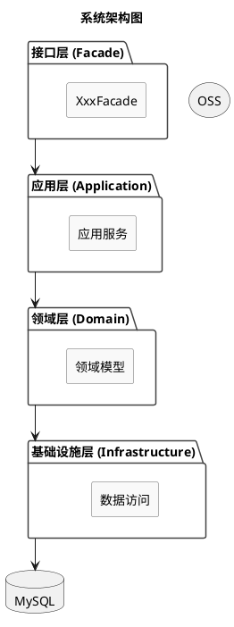
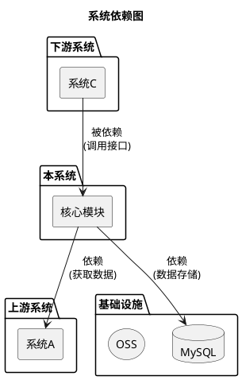
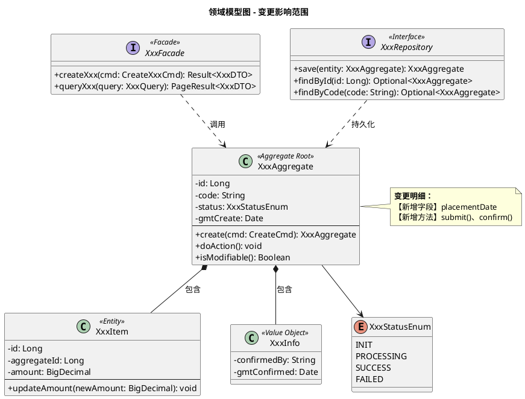
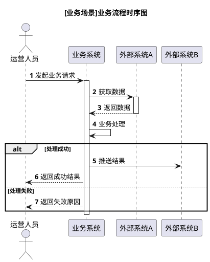
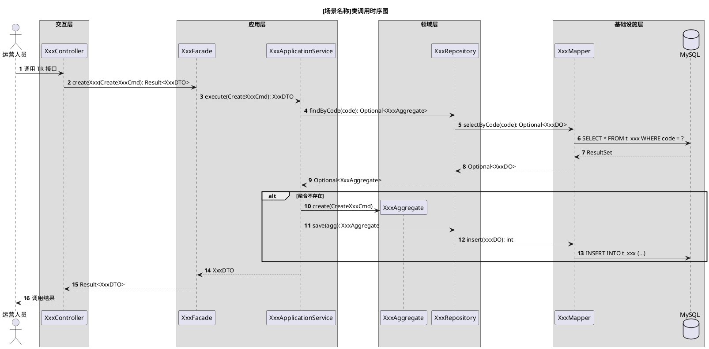
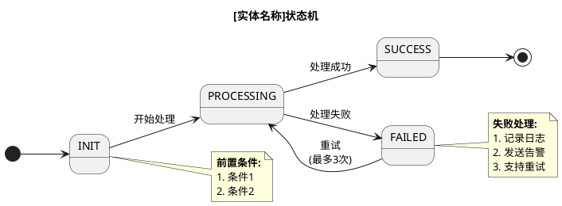
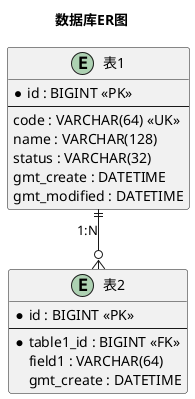
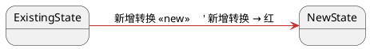
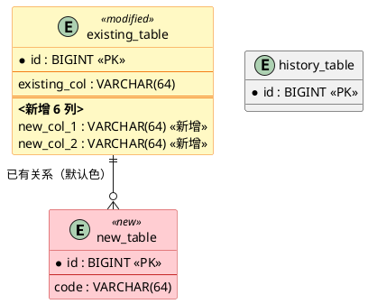
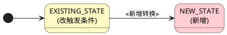

# PlantUML 样式规范

> 系分文档中所有图表必须使用 PlantUML 语言编写。

## 一、通用规则

| 规则 | 说明 |
|------|------|
| 可版本控制 | 纯文本格式，便于 Code Review |
| 可 AI 生成 | 结构化、易修改 |
| 可渲染 | 语雀、钉钉文档等平台支持 |
| 必须自包含 | 每个 `@startuml` ... `@enduml` 完整闭合 |

## 二、兼容性约束（钉钉/飞书渲染限制）

> 以下样式配置可能导致渲染失败，**禁止使用**：

| 禁止使用 | 原因 |
|---------|------|
| `skinparam activity{...}` | activity 相关样式配置不兼容 |
| `skinparam activityBackgroundColor` | 同上 |
| `skinparam defaultFontName` | 自定义字体可能不被识别 |
| `skinparam monochrome` | 单色渲染在某些平台丢失颜色，建议避免 |

> 以下样式配置**可以保留**：

| 可保留 | 说明 |
|--------|------|
| `skinparam shadowing false` | 关闭阴影，安全且提升渲染兼容（推荐默认） |
| `skinparam component{...}` | 组件颜色配置 |
| `skinparam package{...}` | 包颜色配置 |
| `skinparam state{...}` | 状态颜色配置 |
| `autonumber` | 时序图自动编号 |
| `skinparam classAttributeIconSize 0` | 类图属性图标 |

## 三、通用样式模板


## 四、图表类型规范

### 4.1 组件图（系统架构）



### 4.2 系统依赖图



### 4.3 类图（领域模型）

> **关键要求**：领域模型图必须穿透到 Facade 层（无新增 Facade 时用 `<<trigger>>` 入口框替代，见 SKILL.md）。

> **package 分层默认不着色**：分层靠 package 命名（如「领域层 (Domain)」「基础设施层 (Infrastructure)」）区分，**不给 package 加背景色**——颜色只留给本次新增/修改的元素（见第五节「颜色使用纪律」）。
> 若极个别情况确需给 package 着色，颜色**必须写在引号外**作为独立参数，否则钉钉/飞书等渲染器不识别：
> ```plantuml
> ' ✅ 正确：颜色在引号外
> package "领域层 (Domain)" #E8F5E9 { ... }
>
> ' ❌ 错误：颜色塞进引号内，渲染器无法着色
> package "领域层 (Domain) #E8F5E9" { ... }
> ```



**变体类型**：

```
<<Aggregate Root>>    聚合根
<<Entity>>            实体
<<Value Object>>      值对象
<<Interface>>         接口
<<Facade>>            Facade 层接口
<<Domain Service>>    领域服务
<<Domain Event>>      领域事件
<<Enum>>              枚举
```

### 4.4 业务流程时序图（整体设计）

> **参与者使用业务角色名/系统名**，消息使用**业务动作描述**。



### 4.5 类调用时序图（详细设计）

> **参与者使用具体类名**，消息包含**方法签名**（方法名 + 入参类型 + 返回值类型）。



### 4.6 状态图（状态机）



**状态图配色**：状态图**不引入"成功/失败"运行时状态色**（会和变更红冲突），只用红/黄标注本次新增/修改的状态节点。未动的状态节点不上色。状态的运行时含义靠状态名文字表达。

```plantuml
' 状态图只用两色：新增状态=红、修改状态=黄；未动状态不上色；运行时语义靠文字
skinparam state {
  BackgroundColor<<new>> #FFCDD2
  BackgroundColor<<modified>> #FFF9C4
}
```

### 4.7 ER 图（数据库设计）



**ER 图标记说明**：

| 标记 | 含义 |
|------|------|
| `*field` | 主键或非空字段 |
| `<<PK>>` | 主键 |
| `<<FK>>` | 外键 |
| `<<UK>>` | 唯一键 |
| `||--o{` | 一对多 |
| `||--||` | 一对一 |
| `}o--o{` | 多对多 |

## 五、变更可视化配色（新增/修改/已有区分）

> **目的**：系分文档面向评审，必须让读者一眼看出**本次需求动了什么**。图表里只有"本次新增"和"本次修改"两类元素上色，其余一律默认无色。

### 颜色使用纪律（最重要，避免混淆）

**全篇只有两种颜色语义，且默认不上色：**

- 🔴 **红 = 新增**：本次全新引入的元素
- 🟡 **黄 = 修改**：本次改动的已有元素
- **其他一切 = 默认无色**（PlantUML 默认外观）：本次未动的元素、分层 box/package 背景、状态图运行时状态、所有装饰

**三条铁律：**

1. **默认不上色。** 绝大多数元素保持 PlantUML 默认外观。**只有本次新增和修改的元素才上色**。禁止为了"好看"添加任何装饰性颜色——每个颜色都必须是红或黄，且必须对应新增或修改，否则删掉。

2. **颜色语义全局唯一：只有红/黄两种。** 不设"分层色""状态色""已有色"等任何其他颜色语义。分层用文字标题/package 命名区分，不用颜色；已有元素保持默认无色即可（与上色的新增/修改形成自然对比）；状态图的运行时语义（成功/失败）靠状态名文字，不用颜色。

3. **红/黄不挪作他用。** 一旦红=新增、黄=修改确立，全篇任何位置的红/黄都只能是这两个含义。

> 这样做的根本原因：颜色含义越多，越容易混淆。只保留"红=新增、黄=修改"两种，评审看到红就知道是新的、看到黄就知道是改的、没颜色就是没动——零歧义。

### 配色定义

| 语义 | 颜色 | 含义 | 适用 |
|------|------|------|------|
| **新增** | 红 `#FFCDD2`（底）/ `#C62828`（字/边框） | 本次全新引入 | 新类、新字段、新方法、新接口、新表、新节点、新状态 |
| **修改** | 黄 `#FFF9C4`（底）/ `#F57F17`（字/边框） | 本次改动已有元素 | 改签名、加字段、改逻辑的已有类/接口 |
| **已有/未动** | **默认无色** | 本次未动，仅作上下文 | 不变的历史类、被引用的外部系统（不上色，自然作为背景） |

> 配色色值可按团队通用规范调整，但「红=新增、黄=修改、其余无色」的语义不可变，且不可再增加新的颜色语义。

### 各图表类型的上色方式

> **强制适用范围（无一例外）**：以下所有图类型——类图、时序图（业务流程图 + 类调用时序图）、ER 图、状态图、组件/架构图——**都必须**给本次新增（红）和修改（黄）的元素上色。**严禁只在类图/ER 图上色、时序图保持全默认**——这是常见遗漏。时序图里的"操作"同样是变更元素，必须上色：
> - **新增的参与者**：标 `<<new>>`，配 `skinparam sequenceParticipant { BackgroundColor<<new>> #FFCDD2 }`，渲染为红框
> - **新增的消息线**：`A -> B #FFCDD2: 新增的操作`
> - **修改的消息线**：`A -> B #FFF9C4: 修改的操作`（如原同步改异步、原有逻辑本次调整）
> - 已有/未动的参与者和消息：保持默认色不上色
>
> 判断依据：把每条消息、每个参与者都过一遍——"这次需求是不是新加了这个调用？是不是改了这步逻辑？" 是→上色；否→默认色。

#### 类图（领域模型）

```plantuml
@startuml
skinparam classAttributeIconSize 0

' 1. 整类级上色：通过 skinparam class 的 BackgroundColor 分组
skinparam class {
  BackgroundColor<<new>> #FFCDD2
  BackgroundColor<<modified>> #FFF9C4
}

class NewAggregate <<new>> {        ' 整类新增 → 红
  + newMethod(): void
}

class ExistingAggregate <<modified>> { ' 已有类被改 → 黄
  - newField: String
  + changedMethod(): void
}

class HistoryClass {                ' 历史不变 → 不上色（默认外观，作背景）
}

' 2. 字段/方法级上色：行内标注变更类型
class DeliverRecord <<modified>> {
  - signModeCode: String <<新增>>
  - providerInstId: String <<新增>>
  + getSignModeCode(): String <<新增>>
}

@enduml
```

#### 关系连线 / 箭头（所有图通用，最易遗漏）

> **"线"也是变更元素**。不止时序图的消息线，**所有图表里的关系连线/箭头**——类图的关联（聚合/组合/依赖）、ER 图的关系基数线、架构/依赖图的依赖箭头、状态图的转换线——只要本次**新增了这条关系**或**改了这条关系**，线本身也要上色（新增红、修改黄）。评审不仅看节点变色，还要一眼看出"关系结构"层面的变更。
>
> PlantUML 给关系线上色的统一语法：在连线定义里用 `-[#色]->`（中间插入 `[#颜色]`）。关系标签后可加 `: 说明`。

```plantuml
@startuml
' 类图关联线：新增的关系用红，修改的用黄，已有默认色
skinparam class {
  BackgroundColor<<new>> #FFCDD2
  BackgroundColor<<modified>> #FFF9C4
}

class NewClass <<new>>
class ExistingClass <<modified>>
class HistoryClass

NewClass -[#C62828]-> HistoryClass : 新增关联 <<new>>      ' 本次新增的关联 → 红
ExistingClass -[#F57F17]**-> NewClass : 修改的组合关系 <<modified>>  ' 本次改的关系 → 黄
HistoryClass --> ExistingClass                            ' 已有关系 → 默认色
@enduml
```



```plantuml
@startuml
' ER 图关系线 & 架构依赖箭头同理：新增关系标红
entity "new_table" as T1 <<new>>
entity "existing_table" as T2 <<modified>>
T2 ||--o{ T1                 ' 已有关系 → 默认色
' 新增表与某表的关系（若有）：
' T2 ||--[#C62828]o{ T3 : 新增外键 <<new>>
@enduml
```

> **逐条关系过一遍**：对每条 `-->` / `*--` / `||--o{` / 转换线 / 依赖箭头判断"这次需求是不是新建立了这条关联/依赖/转换？是不是改了它？"——是→上色；否→默认色。常见新增场景：新增类之间的聚合、新增外键关系、新增模块依赖、新增状态转换、新增事件监听关系。

#### 时序图（业务/类调用）

> 时序图的参与者用 `<<new>>` 标注后，**必须配 `skinparam sequenceParticipant` 配色块**才显示红框（否则只是文字标签不变色）。消息线上色用 `-> ` 后的 `#颜色`。

```plantuml
@startuml
autonumber

' 参与者配色块（新增参与者红框）；消息线上色用 #颜色
skinparam sequenceParticipant {
  BackgroundColor<<new>> #FFCDD2
}

' box 只做分层命名，不着色；新增参与者标 <<new>> → 红
box "应用层"
  participant "NewService" as S <<new>>   ' 新增参与者 → 红框
  participant "ExistingService" as E      ' 已有参与者 → 默认
end box

A -> S #FFCDD2: 新增的调用步骤      ' 新增消息线 → 红
S -> E #FFF9C4: 修改的调用步骤      ' 修改消息线 → 黄（原同步改异步等）
E -> B: 已有逻辑（默认色，不上色）

note right
  <<修改>> 原为同步，本次改为异步
end note

@enduml
```

#### ER 图（数据库）

> **ER 图配色必须用 stereotype + skinparam 配色块**（最可靠、跨渲染器一致）。
> ⚠️ 若只给 entity 标 `<<new>>`/`<<modified>>` 而**不配 `skinparam class` 配色块**，颜色不生效、渲染为默认色。这是常见漏配，务必成对出现。
> 只有新增/修改的 entity 标 stereotype 并配两色；未动的 entity 不标、不上色（默认外观）。



#### 状态图



### 上色检查清单（生成时自检）

- [ ] **全篇只有红/黄两色**：红=新增、黄=修改，**不再有任何其他颜色语义**（无分层色、无状态色、无灰色）。任何红/黄之外的着色都是违规，删掉
- [ ] **默认无色**：除本次新增（红）和修改（黄）的元素外，所有元素保持 PlantUML 默认外观。box/package 只做分层命名**不着色**；未动的历史元素**不上色**（默认外观自然作为背景，与红黄形成对比）
- [ ] **状态图不引入运行时状态色**：状态节点用红/黄标注本次新增/修改，成功/失败等运行时语义靠状态名文字，不用绿/红编码
- [ ] 每个新增的类/接口/表/状态/消息，整体或标注上**红色**
- [ ] 每个被改动的已有元素（改签名/加字段/改逻辑），上**黄色**
- [ ] **关系连线/箭头也必须上色（最易遗漏）**：类图关联（`-->`/`*--`）、ER 关系线（`||--o{`）、架构依赖箭头、状态转换线——本次**新增的关系**用红（`-[#C62828]->`）、**修改的关系**用黄（`-[#F57F17]->`），已有关系默认色。逐条线过一遍"这次新建立/改了这条关联/依赖/转换吗"
- [ ] **时序图也必须上色**：新增参与者红框（`<<new>>` + `skinparam sequenceParticipant`）、新增消息线红（`#FFCDD2`）、修改消息线黄（`#FFF9C4`）；已有参与者/消息默认色。逐条消息过一遍"这次新加/改了这步吗"
- [ ] **stereotype 与 skinparam 配色块成对出现**：凡是用了 `<<new>>`/`<<modified>>` 标注的图（类图/ER图/状态图），对应 `skinparam class`（ER/entity 复用它）/`skinparam state` 必须定义 `BackgroundColor<<new>>/<<modified>>`——否则颜色不生效。ER 图最易漏，重点自查
- [ ] stereotype 统一用英文 `<<new>>`/`<<modified>>`（字段/方法级的中文 `<<新增>>`/`<<修改>>` 行内标注除外）；未动元素不标 stereotype
- [ ] 图例（legend）注明"红=新增/黄=修改"（可选，整篇文档统一时放文档头即可）

## 六、命名规范

| 类型 | 规范 | 示例 |
|------|------|------|
| 类名 | 大驼峰 | `ReconTask` |
| 方法名 | 小驼峰 | `executeCompare()` |
| 字段名 | 小驼峰 | `taskId` |
| 表名 | 下划线 | `t_recon_task` |
| 字段名（DB） | 下划线 | `task_status` |
| 枚举值 | 大写下划线 | `TASK_STATUS_INIT` |
| 索引名 | 前缀_含义 | `uk_code`、`idx_status` |

## 六、参与者顺序约定

时序图参与者从左到右排列：

```
触发方（Actor/定时任务）→ 前端 → Facade → Application → Domain Service → Aggregate → Repository → Mapper → DB → 外部系统
```

**同一角色在所有图表中使用相同命名**（如：运营人员统一用 `Ops` 或 `User`，不可混用）。