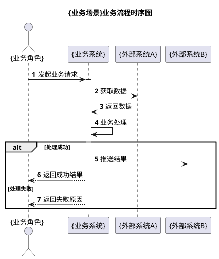

# {需求标题} 产品需求文档（PRD）

> **文档类型**: 产品需求文档（PRD）
> **适用层级**: L1 业务规范
> **读者**: 产品经理 / 业务方 / 开发 / 测试 / 评审
> **编写规范**: 业务视角描述，不涉及技术实现；图表使用 PlantUML

---

## 文档修订历史

| 版本 | 修改内容 | 修改人 | 时间 |
| --- | --- | --- | --- |
| v1.0 | 初始版本 | {作者} | YYYY-MM-DD |

---

# 一、背景与目标

## 1.1 需求背景

<!-- GEN-GUIDE（生成时删除，不进成品）：引用 PD 原始需求/契约的问题定义，用业务语言描述现状与痛点。
  本节是「为什么做」，不是「怎么做」。技术实现细节留给 SDD。 -->

{业务背景描述：当前现状、遇到的问题、触发本次需求的原因}

**核心痛点**：

| 痛点 | 说明 | 业务影响 |
| --- | --- | --- |
| {痛点1} | {描述} | {对业务/用户的影响} |
| {痛点2} | {描述} | {对业务/用户的影响} |

## 1.2 需求目标

<!-- GEN-GUIDE（生成时删除，不进成品）：从契约的问题定义 + PD 原始需求提炼，用「业务目标」而非「技术目标」表述。 -->

建立/优化/实现 {业务能力}，达到：
- {目标1}
- {目标2}

## 1.3 业务价值

| 价值维度 | 说明 | 预期收益 |
| --- | --- | --- |
| 效率 | {描述} | {量化，如「人工成本降低 XX%」} |
| 准确性 | {描述} | {量化} |
| 体验 | {描述} | {量化} |
| 合规 | {描述} | {量化} |

## 1.4 关键指标

| 指标 | 目标值 | 说明 |
| --- | --- | --- |
| {指标1，如「处理时效」} | {如「< 30 秒」} | {口径说明} |
| {指标2，如「准确率」} | {如「≥ 99%」} | {口径说明} |

---

# 二、用户与角色

<!-- GEN-GUIDE（生成时删除，不进成品）：列出本需求涉及的业务角色及其诉求。若无多角色，可简化为一段文字。 -->

| 角色 | 描述 | 核心诉求 | 使用场景 |
| --- | --- | --- | --- |
| {角色1，如「运营人员」} | {职责描述} | {要解决什么问题} | {何时使用} |
| {角色2，如「财务审核」} | {职责描述} | {要解决什么问题} | {何时使用} |

---

# 三、核心功能

## 3.1 功能清单

<!-- GEN-GUIDE（生成时删除，不进成品）：从契约的 API 契约/业务规则归纳出面向用户的功能点。
  功能 ID = F-NN，与契约 API 对应但不等于方法名（业务语言）。优先级与契约一致。 -->

| 功能 ID | 功能名称 | 优先级 | 说明 | 关联契约 |
| --- | --- | --- | --- | --- |
| F-01 | {功能1} | P0 | {一句话说明} | BR-001 |
| F-02 | {功能2} | P0 | {一句话说明} | BR-002 |
| F-03 | {功能3} | P1 | {一句话说明} | - |

## 3.2 功能详情

### F-01: {功能名称}

**功能描述**: {这个功能做什么，用户如何使用}

**触发方式**: {用户操作 / 定时任务 / 事件驱动}

**输入/输出**（业务概念，非接口签名）:

| 项 | 说明 |
| --- | --- |
| 输入 | {用户需提供什么} |
| 输出 | {用户得到什么} |
| 前置条件 | {什么情况下可用} |

**业务约束**: {功能级约束，如「每天仅可执行一次」「仅管理员可用」}

---

# 四、业务流程

<!-- GEN-GUIDE（生成时删除，不进成品）：本节画「业务流程时序图」——业务视角。
  参与者用业务角色名/系统名（如「运营人员」「对账系统」），消息用业务动作描述（如「发起对账」）。
  切勿画成技术时序图（类名+方法签名），那是 SDD 第四章详细设计的内容。
  变更可视化纪律同 SDD：本次新增的流程/分支用红色，修改的用黄色，其余默认无色。 -->

## 4.1 业务流程概述

| 步骤 | 角色 | 业务动作 | 说明 |
| --- | --- | --- | --- |
| 1 | {角色1} | {动作描述} | {说明} |
| 2 | {角色2} | {动作描述} | {说明} |
| 3 | {系统} | {动作描述} | {说明} |

## 4.2 业务流程时序图



---

# 五、状态流转

<!-- GEN-GUIDE（生成时删除，不进成品）：若涉及状态变化，从契约的状态机提炼业务状态流转。
  PRD 的状态机用业务语言（如「待确认」「已完成」），可与契约枚举名映射但需附业务含义。
  无状态流转的 Feature 整节删除（标题+图+说明），不留空占位。 -->

## 5.1 状态机

```plantuml
@startuml
title {业务对象}状态机

left to right direction
skinparam shadowing false

[*] --> {INIT}

{INIT} --> {STATE_A} : {触发条件}
{STATE_A} --> {STATE_B} : {触发条件}
{STATE_B} --> {COMPLETED} : {触发条件}
{STATE_A} --> {FAILED} : {异常条件}

{COMPLETED} --> [*]

note right of {INIT}
  <b>前置条件:</b>
  1. {条件1}
end note

note right of {FAILED}
  <b>失败处理:</b>
  1. {处理方式}
end note

@enduml
```

## 5.2 状态说明

| 状态 | 业务含义 | 是否终态 | 可执行操作 |
| --- | --- | --- | --- |
| {INIT} | {初始化} | 否 | {操作列表} |
| {STATE_A} | {处理中} | 否 | {操作列表} |
| {COMPLETED} | {已完成} | 是 | - |
| {FAILED} | {失败} | 否 | {可重试等} |

## 5.3 状态转换规则

| 从 | 到 | 触发条件 | 守卫条件 |
| --- | --- | --- | --- |
| {INIT} | {STATE_A} | {触发} | {前置校验} |
| {STATE_A} | {COMPLETED} | {触发} | {前置校验} |

**禁止转换**:
- {INIT} → {COMPLETED}（不可跳过中间状态）
- {COMPLETED} → 其它状态（终态不可逆）

---

# 六、业务数据模型

<!-- GEN-GUIDE（生成时删除，不进成品）：本节是「业务概念级」数据模型，描述业务对象有哪些字段及含义，
  不写 DDL/类型精度/索引（那是 SDD 第六章数据库设计的内容）。
  字段从契约的领域模型/Schema 变更提炼，用业务能理解的语言。 -->

## 6.1 {业务对象1}

> 对应契约聚合根/实体：{AggregateName}

| 业务字段 | 含义 | 是否必填 | 示例 |
| --- | --- | --- | --- |
| {任务编号} | {业务唯一标识} | 是 | "{示例}" |
| {状态} | {当前业务状态} | 是 | "{示例}" |
| {金额} | {业务金额，币种 XXX} | 是 | "{示例}" |

## 6.2 {业务对象2}

> 对应契约聚合根/实体：{AggregateName}

| 业务字段 | 含义 | 是否必填 | 示例 |
| --- | --- | --- | --- |
| {字段1} | {含义} | 是 | "{示例}" |

## 6.3 业务对象关系

<!-- GEN-GUIDE（生成时删除，不进成品）：单对象且无关联可简化为一句话；多对象用业务语言描述关系。
  不画 ER 图（SDD 才画），这里用文字或简单列表。 -->

- {对象1} 1:N {对象2}（一个 {对象1} 包含多个 {对象2}）
- {对象1} 关联 {外部对象}（引用 {外部系统} 的 {标识}）

---

# 七、业务规则

<!-- GEN-GUIDE（生成时删除，不进成品）：从契约的业务规则 BR-xxx 提炼，用业务语言重述（去掉技术校验逻辑）。
  规则 ID 与契约保持一致（BR-001 对应契约 BR-001），便于双向追溯。 -->

| 规则 ID | 规则名称 | 规则说明 | 优先级 | 关联功能 |
| --- | --- | --- | --- | --- |
| BR-001 | {规则1，如「任务唯一性」} | {业务语言描述，含精确条件} | P0 | F-01 |
| BR-002 | {规则2，如「状态流转」} | {描述} | P0 | F-02 |
| BR-003 | {规则3，如「红绿灯判定」} | {描述：GREEN=差异率0%、AMBER=0~1%、RED=>1%} | P0 | F-03 |
| BR-004 | {规则4} | {描述} | P1 | - |

---

# 八、非功能需求

## 8.1 性能要求

| 指标 | 要求 | 说明 |
| --- | --- | --- |
| 单次处理时效 | {如「< 30 秒」} | {口径} |
| 并发支持 | {如「≥ 100 并发」} | {口径} |
| 批量处理 | {如「≥ 1000 条/次」} | {口径} |

## 8.2 安全要求

- {操作审计日志：记录关键操作}
- {敏感数据加密：如金额、证件号}
- {权限控制：仅 {角色} 可操作}

## 8.3 可用性与兼容性

- 可用性目标：{如「≥ 99.9%」}
- 兼容性：{对现有功能/数据的影响，历史数据如何处理}

## 8.4 合规要求

<!-- GEN-GUIDE（生成时删除，不进成品）：金融/政务等强合规场景必填；无要求可整节删除。 -->

- {合规项，如「操作可追溯，满足审计要求」}

---

# 九、验收标准

<!-- GEN-GUIDE（生成时删除，不进成品）：从契约的验收条件整合，用「业务语言」重述（让业务/测试能看懂）。
  与契约 AC 保持映射关系，但表述面向业务而非程序验证方式。
  契约里的「验证方式: 测试/脚本」是给 /goal 机器用的；本节是给业务/测试人读的。 -->

## 9.1 功能验收

- [ ] {支持 {核心功能1}，{可观测的业务效果}}
- [ ] {状态流转完整：{INIT} → ... → {COMPLETED}}
- [ ] {业务规则 BR-001 生效：{业务效果}}
- [ ] {差异/结果准确，{量化标准}}

## 9.2 非功能验收

- [ ] {单次处理 < {X} 秒}
- [ ] {并发 {N} 任务稳定}
- [ ] {操作日志完整，可追溯}

## 9.3 验收标准与契约映射

| PRD 验收项 | 契约 AC | 说明 |
| --- | --- | --- |
| {PRD 验收1} | AC-001 | {映射关系} |
| {PRD 验收2} | AC-002 | {映射关系} |

---

# 十、依赖与边界

## 10.1 范围内（本次要做）

- {功能/场景1}
- {功能/场景2}

## 10.2 范围外（本次不做）

<!-- GEN-GUIDE（生成时删除，不进成品）：明确边界，防止范围蔓延。无则整节删除。 -->

- {明确不做的项及原因}

## 10.3 上下游依赖

| 依赖类型 | 系统/模块 | 说明 | 影响 |
| --- | --- | --- | --- |
| 上游（数据来源） | {系统A} | {提供什么} | {不可用时的影响} |
| 下游（结果输出） | {系统B} | {推送什么} | {不可用时的影响} |

---

# 附录

## A. 术语表

<!-- GEN-GUIDE（生成时删除，不进成品）：业务术语词汇表，减少业务/开发理解偏差。 -->

| 术语 | 解释 |
| --- | --- |
| {业务概念1} | {解释} |
| {业务概念2} | {解释} |

## B. 参考文档

- 行为契约：[{F-ID}-{short-name}](../contracts/{F-ID}-{short-name}.md)（本 PRD 的主输入，同编号绑定）
- 系分文档：[{F-ID}-{short-name}](./{F-ID}-{short-name}.md)（如已生成，SDD-{F-ID}）
- 原始需求：{PD 文档/会议纪要出处}
- 相关联需求：[{其他 F-ID}-{name}](./{其他 F-ID}-{name}.md)

---

*v{X.X} - {YYYY-MM-DD} - {版本说明}*
