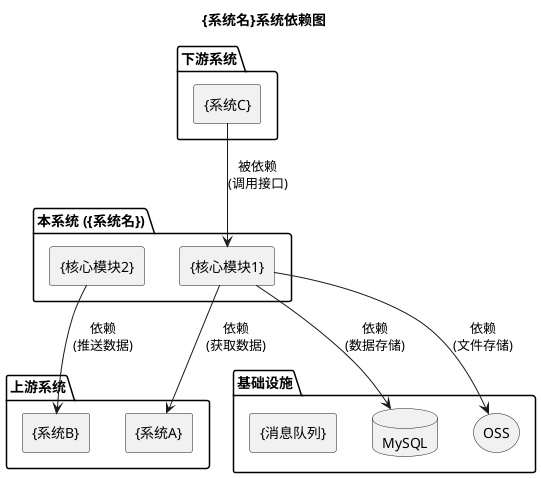
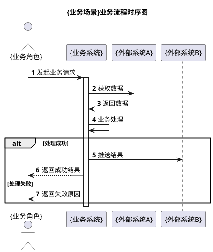
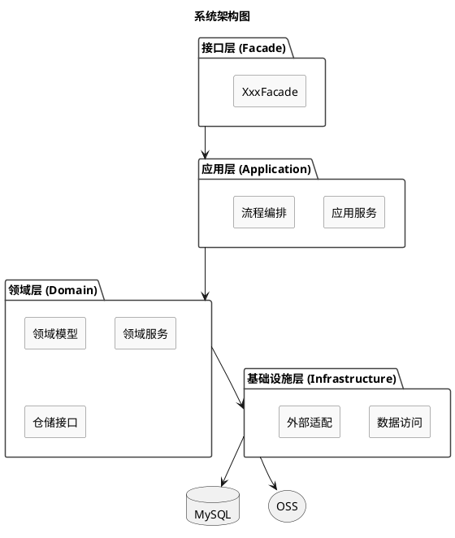
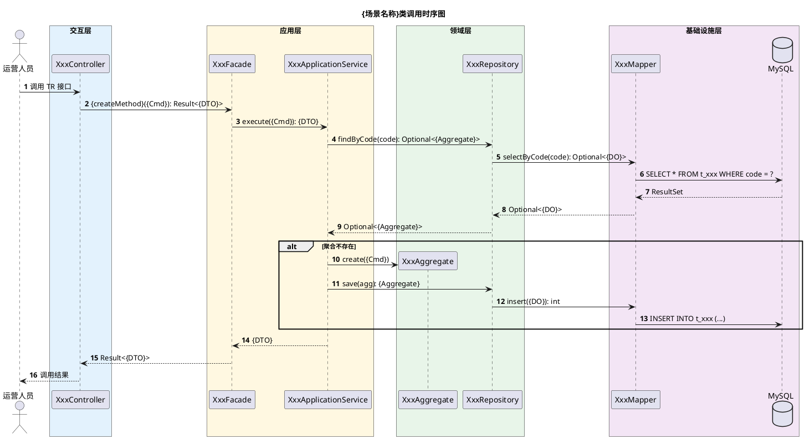
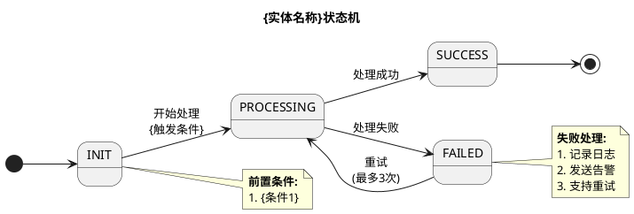
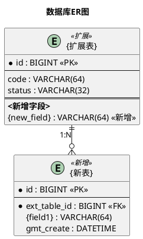

# {需求标题}系统设计

> **文档类型**: 系统分析设计文档（SDD）
> **适用层级**: L2 功能规范
> **编写规范**: 遵循阿里/蚂蚁系分规范，所有图表使用 PlantUML

---

## 文档修订历史

| 版本 | 修改内容 | 修改人 | 时间 |
| --- | --- | --- | --- |
| v1.0 | 初始版本 | {作者} | YYYY-MM-DD |

---

# 一、需求概述

## 1.1 需求分析

### 1.1.1 需求背景

<!-- GEN-GUIDE（生成时删除，不进成品）：引用 PRD/契约的需求背景，补充技术视角说明 -->

**核心痛点**：

| 痛点 | 说明 | 影响 |
| --- | --- | --- |
| {痛点1} | {描述} | {业务影响} |
| {痛点2} | {描述} | {业务影响} |

**解决思路**：

- {思路1}
- {思路2}

### 1.1.2 需求范围

| 域 | 来源 | 变更范围 | 实现状态 |
| --- | --- | --- | --- |
| {域1} | {需求来源} | 1. {变更点1}<br/>2. {变更点2} | ❌ 待开发 |
| {域2} | {需求来源} | 1. {变更点1} | ✅ 已完成 |

### 1.1.3 涉及的业务域范围

<!-- GEN-GUIDE（生成时删除，不进成品）：业务术语词汇表，减少理解偏差 -->

| 名词 | 解释 |
| --- | --- |
| {业务概念1} | {解释} |
| {业务概念2} | {解释} |

### 1.1.4 相关文档

- 行为契约：[{F-ID}-{short-name}](../contracts/{F-ID}-{short-name}.md)（同编号绑定）
- 相关系分：[{其他 F-ID}-{name}](./{其他 F-ID}-{name}.md)

---

# 二、系统分析

## 2.1 系统依赖



## 2.2 相关依赖分析

**强依赖**（不可降级）：

| 依赖系统 | 依赖说明 | 接口/方法 | 降级方案 |
| --- | --- | --- | --- |
| {系统A} | {说明} | {/api/xxx} | 无，直接报错 |

**弱依赖**（可降级）：

| 依赖系统 | 依赖说明 | 接口/方法 | 降级方案 |
| --- | --- | --- | --- |
| {系统B} | {说明} | {/api/xxx} | 返回默认值/缓存数据 |

**被依赖**：

| 下游系统 | 调用场景 | 接口/方法 | SLA要求 |
| --- | --- | --- | --- |
| {系统C} | {说明} | {/api/xxx} | 99.9% |

---

# 三、整体设计

## 3.1 业务流程

<!-- GEN-GUIDE（生成时删除，不进成品）：本节画「整体设计业务时序图」，业务视角——
  参与者用业务角色名/系统名（如运营人员、对账系统），消息用业务动作描述（如"发起对账"）。
  切勿与第四章「详细设计类调用时序图」混淆：那里才是技术视角（类名+方法签名）。 -->

### 3.1.1 业务流程概述

| 步骤 | 角色 | 业务动作 | 说明 |
| --- | --- | --- | --- |
| 1 | {角色1} | {动作描述} | {说明} |
| 2 | {角色2} | {动作描述} | {说明} |

### 3.1.2 业务流程时序图



## 3.2 系统架构

### 3.2.1 架构分层

```
┌─────────────────────────────────────────────┐
│  接口层 (Facade)                             │
│  - XxxFacade：RPC 接口                       │
└─────────────────────────────────────────────┘
                    ↓
┌─────────────────────────────────────────────┐
│  应用层 (Application)                        │
│  - 业务流程编排、Command/Query 处理          │
└─────────────────────────────────────────────┘
                    ↓
┌─────────────────────────────────────────────┐
│  领域层 (Domain)                             │
│  - 领域模型、领域服务、仓储接口              │
└─────────────────────────────────────────────┘
                    ↓
┌─────────────────────────────────────────────┐
│  基础设施层 (Infrastructure)                 │
│  - 数据访问、外部系统集成                    │
└─────────────────────────────────────────────┘
```

### 3.2.2 模块架构图



### 3.2.3 模块划分

| 模块 | 职责 | 核心能力 | 技术栈 |
| --- | --- | --- | --- |
| 接口层 | RPC接口 | {能力1}、{能力2} | SOFABoot |
| 应用层 | 流程编排 | {能力1} | SOFABoot |
| 领域层 | 业务逻辑 | {能力1} | DDD |
| 基础设施层 | 技术实现 | 数据访问、外部接口调用 | MyBatis |

## 3.3 领域模型

<!-- GEN-GUIDE（生成时删除，不进成品）：领域模型图绘制要求——
  · 必须穿透到 Facade 层（无新增 Facade 时用 <<trigger>> 入口框替代，见 SKILL.md）；
  · 新增/修改的字段、方法用 <<新增>>/<<修改>> 标记；历史类仅展示类名和关系；
  · 新增/修改的字段、方法必须有文字注释说明业务含义。 -->

### 3.3.1 领域模型变更概览

| 层级 | 类名 | 变更类型 | 变更说明 |
| --- | --- | --- | --- |
| Facade | {XxxFacade} | 新增方法 | {方法1}()、{方法2}() |
| 领域层 | {XxxAggregate} | 新增字段 | {field1}、{field2} |
| 领域层 | {XxxAggregate} | 新增方法 | {method1}() |
| 仓储层 | {XxxRepository} | 新增方法 | {method1}() |

### 3.3.2 领域模型图

```plantuml
@startuml
title 领域模型图 - 本次变更影响范围

skinparam componentStyle uml2
skinparam packageStyle rectangle
skinparam classAttributeIconSize 0
skinparam nodesep 50
skinparam ranksep 60

' 1. Facade 层
interface {XxxFacade} <<Facade>> {
  + {queryMethod}(query: {Query}): PageResult<{DTO}>
  + {createMethod}(cmd: {Cmd}): Result<{DTO}>
}

note right of {XxxFacade}
  <b>Facade 方法变更：</b>
  【已有】{method1}()
  【新增】{method2}()
end note

' 2. 聚合根
class {XxxAggregate} <<Aggregate Root>> {
  - id: Long
  - code: String
  - status: {Status}Enum
  - {newField}: {Type} <<新增>>
  --
  + {existingMethod}(): void
  + {newMethod}(): void <<新增>>
}

note right of {XxxAggregate}
  <b>变更明细：</b>
  【新增字段】
  {newField} - {业务含义}

  【新增方法】
  {newMethod}() - {业务规则}
end note

' 3. 实体
class {XxxItem} <<Entity>> {
  - id: Long
  - aggregateId: Long
  - amount: BigDecimal
}

' 4. 值对象
class {XxxInfo} <<Value Object>> {
  - operator: String
  - gmtOperate: Date
}

' 5. 仓储接口
interface {XxxRepository} <<Interface>> {
  + save(entity: {XxxAggregate}): {XxxAggregate}
  + findById(id: Long): Optional<{XxxAggregate}>
  + findByCode(code: String): Optional<{XxxAggregate}>
}

note bottom of {XxxRepository}
  <b>仓储接口变更：</b>
  【新增】{newRepoMethod}()
end note

' 6. 关联关系
{XxxFacade} ..> {XxxAggregate} : 调用
{XxxAggregate} *-- {XxxItem} : 包含
{XxxAggregate} *-- {XxxInfo} : 包含
{XxxRepository} ..> {XxxAggregate} : 持久化

@enduml
```

### 3.3.3 聚合根详细设计

#### {AggregateName}: {中文描述}聚合根

**职责描述**：{管理什么的生命周期，包括哪些操作}

**字段变更明细**：

| 属性名 | 类型 | 变更类型 | 说明 | 业务含义 |
| --- | --- | --- | --- | --- |
| id | Long | 已有 | 主键ID | 物理主键 |
| code | String | 已有 | 业务编码 | 唯一标识 |
| status | {Status}Enum | 已有 | 状态 | 状态机控制 |
| {newField} | {Type} | **新增** | {字段说明} | {业务含义} |

**方法变更明细**：

| 方法名 | 参数 | 返回值 | 变更类型 | 说明 | 业务规则 |
| --- | --- | --- | --- | --- | --- |
| {existingMethod} | {Cmd} | {Entity} | 已有 | {说明} | {规则} |
| {newMethod} | {param} | void | **新增** | {说明} | {状态流转规则} |

### 3.3.4 仓储接口变更

| 接口方法 | 参数 | 返回值 | 变更类型 | 说明 |
| --- | --- | --- | --- | --- |
| {newMethod} | {param} | {Type} | **新增** | {说明} |

---

# 四、详细设计

<!-- GEN-GUIDE（生成时删除，不进成品）：本章每个业务场景画「类调用时序图」——技术视角：
  参与者必须是具体类名（Controller/Service/Repository/Domain），消息必须含方法签名
  （方法名+入参类型+返回值类型），可直接指导编码。与第三章业务时序图的区别仅在粒度。 -->

## 4.1 {业务场景一：场景名称}

### 4.1.1 类调用时序图



### 4.1.2 调用链路说明

| 步骤 | 调用方 | 被调用方 | 方法签名 | 说明 |
| --- | --- | --- | --- | --- |
| 1 | User | XxxController | com.xxx.facade.XxxFacade:{createMethod} | TR 接口入口 |
| 2 | Controller | XxxFacade | {createMethod}({Cmd}): Result<{DTO}> | Facade 层入口 |
| 3 | Facade | XxxApplicationService | execute({Cmd}): {DTO} | 应用服务编排 |
| 4 | AppService | XxxRepository | findByCode(String code): Optional<{Aggregate}> | 查询幂等性 |
| 5 | Repository | XxxMapper | selectByCode(code) | MyBatis 查询 |
| 6 | AppService | XxxAggregate | create({Cmd}) | 领域对象创建 |
| 7 | AppService | XxxRepository | save({Aggregate}) | 持久化 |

### 4.1.3 状态机

<!-- GEN-GUIDE（生成时删除，不进成品）：仅当该场景实体有状态流转时保留本节并画状态机；
  无状态流转则整节删除（标题+图+说明），不要留空标题或"无状态机"占位。 -->



### 4.1.4 业务规则

| 规则ID | 规则名称 | 规则说明 | 优先级 |
| --- | --- | --- | --- |
| BR-{DOMAIN}-001 | {规则1} | {说明} | P0 |
| BR-{DOMAIN}-002 | {规则2} | {说明} | P0 |
| BR-{DOMAIN}-003 | {状态流转} | {状态A} → {状态B} | P0 |

## 4.2 {业务场景二：场景名称}

<!-- GEN-GUIDE（生成时删除，不进成品）：每个核心业务场景照 4.1 结构各起一节（类调用时序图+调用链路+业务规则）。非业务场景的场景（如纯数据补齐）可只保留必要小节。 -->

---

# 五、接口设计

## 5.1 Facade 接口定义

### 5.1.1 {接口名称}（{新增/扩展}）

**Facade 接口**: `{Xxx}Facade.{methodName}({Request})`

**接口描述**: {描述接口功能}

**请求参数**:

| 参数名 | 类型 | 必填 | 说明 | 示例 |
| --- | --- | --- | --- | --- |
| {param1} | String | 是 | {说明} | "{示例}" |
| {param2} | String | 否 | {说明} | "{示例}" |

**请求示例**:

```java
{Request} request = new {Request}();
request.set{Param1}("value1");
request.set{Param2}("value2");
Result<{DTO}> result = {xxx}Facade.{methodName}(request);
```

**响应参数**:

| 参数名 | 类型 | 说明 |
| --- | --- | --- |
| success | Boolean | 是否成功 |
| code | String | 响应码 |
| message | String | 响应消息 |
| data | T | 响应数据 |

**响应示例**:

```java
Result<{DTO}> result = Result.success({dto});
// 或
Result<{DTO}> result = Result.fail("ERROR_CODE", "错误信息");
```

**业务规则**:

- {规则1}
- {规则2}

**错误码**:

| 错误码 | 说明 | 处理建议 |
| --- | --- | --- |
| {XXX}_NOT_FOUND | {说明} | {建议} |
| {XXX}_STATUS_INVALID | {说明} | {建议} |
| {XXX}_DUPLICATE | {说明} | {建议} |

## 5.2 外部系统集成接口

<!-- GEN-GUIDE（生成时删除，不进成品）：本节定义调用其他系统的客户端接口（ACL/RPC 封装） -->

### 5.2.1 {外部系统} - {方法名}

**客户端类**: `{全路径}`

**方法**: `{method}({Request})`

**接口描述**: {描述}

**请求参数**:

| 参数名 | 类型 | 必填 | 说明 |
| --- | --- | --- | --- |
| {param1} | String | 是 | {说明} |

**响应参数**: `Result<Boolean>`

| 参数名 | 类型 | 说明 |
| --- | --- | --- |
| success | Boolean | {说明} |

## 5.3 幂等与异常处理

### 5.3.1 幂等设计

| 接口 | 幂等性设计 | 幂等键 | 说明 |
| --- | --- | --- | --- |
| {接口1} | 基于唯一键 | {bizCode} | 重复创建返回已存在记录 |
| {接口2} | 基于状态校验 | {id} + status | 状态不变更即幂等 |
| {接口3} | 基于幂等重算 | {id} + month | 重复操作结果一致 |

### 5.3.2 异常处理

**异常处理标准表**：

| 异常类型 | 异常类 | 处理策略 | 是否重试 | 告警级别 | 日志级别 |
| --- | --- | --- | --- | --- | --- |
| 参数校验异常 | IllegalArgumentException | 返回错误码 | 否 | INFO | WARN |
| 业务异常 | BusinessException | 返回业务错误码 | 否 | INFO | WARN |
| 唯一冲突 | DuplicateKeyException | 返回冲突提示 | 否 | WARN | WARN |
| 数据库异常 | DataAccessException | 重试3次 | 是 | ERROR | ERROR |
| 远程调用超时 | TimeoutException | 降级处理 | 否 | WARN | WARN |
| 未知异常 | RuntimeException | 返回SYSTEM_ERROR | 否 | ERROR | ERROR |

**【黄山版】异常处理规范**：

```java
// ❌ 禁止捕获 Throwable 或 Exception
try {
    // do something
} catch (Throwable e) { }

// ✅ 捕获具体异常
try {
    // do something
} catch (BusinessException e) {
    // 业务异常处理
}
```

**【黄山版】日志规范**：

```java
// ✅ 异常日志仅记录错误信息，不打印堆栈
log.error("业务处理失败, param={}, error={}, errorDetail={}",
    param, e.getClass().getSimpleName(), e.getMessage());

// 仅排查问题时打印堆栈（warn/debug 级别）
log.warn("业务处理异常, param={}, stackTrace={}",
    param, ExceptionUtils.getStackTrace(e));
```

**降级策略**：

| 场景 | 降级方案 | 用户提示 |
| --- | --- | --- |
| {外部系统不可用} | 返回缓存数据/默认值 | {提示文案} |

---

# 六、数据库设计

## 6.1 ER图



## 6.2 表结构设计

### 6.2.1 {表名}（{新增/扩展}）

**表说明**: {描述表的用途}

#### 新增表

| 字段名 | 类型 | 非空 | 默认值 | 说明 | 索引 |
| --- | --- | --- | --- | --- | --- |
| id | BIGINT(20) | Y | - | 主键ID | PK |
| code | VARCHAR(64) | Y | - | 业务编码 | UK |
| status | VARCHAR(32) | Y | 'INIT' | 状态 | IDX |
| gmt_create | DATETIME | Y | CURRENT_TIMESTAMP | 创建时间 | - |
| gmt_modified | DATETIME | Y | CURRENT_TIMESTAMP | 修改时间 | - |
| creator | VARCHAR(64) | Y | 'system' | 创建人 | - |
| modifier | VARCHAR(64) | Y | 'system' | 修改人 | - |
| is_deleted | CHAR(1) | Y | 'n' | 逻辑删除 | - |

**索引设计**:

```sql
PRIMARY KEY (`id`)
UNIQUE KEY `uk_code` (`code`, `is_deleted`)
KEY `idx_status` (`status`)
KEY `idx_gmt_create` (`gmt_create`)
```

**建表语句**:

```sql
CREATE TABLE `{table_name}` (
  `id` bigint(20) unsigned NOT NULL AUTO_INCREMENT COMMENT '主键ID',
  `code` varchar(64) NOT NULL COMMENT '业务编码',
  `status` varchar(32) NOT NULL DEFAULT 'INIT' COMMENT '状态',
  `gmt_create` datetime NOT NULL DEFAULT CURRENT_TIMESTAMP COMMENT '创建时间',
  `gmt_modified` datetime NOT NULL DEFAULT CURRENT_TIMESTAMP ON UPDATE CURRENT_TIMESTAMP COMMENT '修改时间',
  `creator` varchar(64) NOT NULL DEFAULT 'system' COMMENT '创建人',
  `modifier` varchar(64) NOT NULL DEFAULT 'system' COMMENT '修改人',
  `is_deleted` char(1) NOT NULL DEFAULT 'n' COMMENT '逻辑删除标识(y/n)',
  PRIMARY KEY (`id`),
  UNIQUE KEY `uk_code` (`code`, `is_deleted`),
  KEY `idx_status` (`status`)
) ENGINE=InnoDB DEFAULT CHARSET=utf8mb4 COMMENT='{表说明}';
```

#### 扩展表（新增字段）

**变更 SQL**:

```sql
ALTER TABLE `{table_name}` ADD COLUMN (
  `{new_field}` varchar(64) DEFAULT NULL COMMENT '{字段说明}'
);

ALTER TABLE `{table_name}` ADD KEY `idx_{new_field}` (`{new_field}`);
```

**【黄山版】基础字段标准**：

所有表必须包含：
- `DATETIME` 而非 `TIMESTAMP`（避免时区问题和 2038 年问题）
- 金额字段使用 `DECIMAL(18,2)` 或 `DECIMAL(20,4)`
- JSON 字段使用 `JSON` 类型

**【黄山版】索引规范**：
- 唯一索引必须包含 `is_deleted`
- 索引命名：`uk_[业务含义]`、`idx_[字段名]`

---

# 七、兼容性分析

## 7.1 数据兼容性

| 兼容项 | 影响范围 | 处理方案 | 负责人 |
| --- | --- | --- | --- |
| 历史数据 | {说明} | {处理方案} | 后端 |
| 新增枚举值 | {说明} | {处理方案} | 后端 |

## 7.2 接口兼容性

| 兼容项 | 影响范围 | 处理方案 | 负责人 |
| --- | --- | --- | --- |
| 现有接口 | {是否破坏性变更} | {方案} | 后端 |
| VO 扩展 | 新增字段 | 可选字段，不影响现有调用 | 前端 |

## 7.3 版本兼容性

| 版本 | 兼容说明 | 注意事项 |
| --- | --- | --- |
| v1.0 | 现有功能 | 不受影响 |
| v2.0 | 新功能 | 增量添加 |

---

# 八、测试及回归建议

## 8.1 测试重点

| 测试场景 | 测试重点 | 测试方法 | 优先级 |
| --- | --- | --- | --- |
| {场景1} | {重点} | 功能测试 | P0 |
| {场景2} | {重点} | 状态机测试 | P0 |
| {场景3} | {重点} | 并发测试 | P1 |

## 8.2 回归范围

| 模块 | 回归内容 | 回归原因 | 负责人 |
| --- | --- | --- | --- |
| {模块1} | {内容} | {原因} | 后端 |
| {模块2} | {内容} | 间接影响 | 后端 |

---

# 九、风险评估

## 9.1 依赖评估

| 依赖项 | 风险等级 | 风险描述 | 应对措施 | 负责人 |
| --- | --- | --- | --- | --- |
| {依赖1} | 高/中/低 | {描述} | {措施} | 后端 |

## 9.2 技术风险

| 风险项 | 风险等级 | 风险描述 | 应对措施 | 负责人 |
| --- | --- | --- | --- | --- |
| 状态机并发 | 中 | 并发操作导致状态冲突 | 分布式锁 | 后端 |
| 查询性能 | 低 | {描述} | 索引优化 | 后端 |

---

# 十、三板斧

## 10.1 监控与核对

**监控梳理**:

| 监控项 | 监控指标 | 告警阈值 | 告警级别 | 负责人 |
| --- | --- | --- | --- | --- |
| {接口}失败率 | 失败/总数 | > 10% 告警 | P2 | 运维 |
| 数据同步延迟 | 延迟时间 | > 1h 告警 | P2 | 运维 |

**核对梳理**:

| 核对项 | 核对规则 | 核对频率 | 异常处理 | 负责人 |
| --- | --- | --- | --- | --- |
| {数据一致性} | {规则} | 每日 | 人工介入 | {角色} |

## 10.2 灰度与切流

**灰度策略**:

| 阶段 | 灰度范围 | 灰度比例 | 持续时间 | 观察指标 |
| --- | --- | --- | --- | --- |
| 阶段1 | 指定机构 | 10% | 3天 | {指标} |
| 阶段2 | 所有机构 | 50% | 3天 | {指标} |
| 阶段3 | 全量 | 100% | - | 全部指标 |

**切流方案**:

| 切流条件 | 切流操作 | 回滚操作 | 负责人 |
| --- | --- | --- | --- |
| 灰度指标达标 | 增加灰度比例 | 降低灰度比例 | 运维 |

## 10.3 应急方案

| 场景 | 应急措施 | 操作步骤 | 预计恢复时间 | 负责人 |
| --- | --- | --- | --- | --- |
| {外部系统故障} | {措施} | 1. {步骤}<br/>2. {步骤} | 5min | 运维 |
| 代码回滚 | 回滚版本 | 1. {步骤}<br/>2. {步骤} | 10min | 开发 |
| 数据异常 | 人工修复 | 执行修复脚本 | 30min | 开发 |

---

# 十一、工作量拆分

> **倒排项目**：里程碑截止时间固定，根据截止时间倒排人力需求

## 里程碑与人力需求

| 里程碑 | 截止时间 | 工作量 | 可用工作日 | 所需人力 |
| --- | --- | --- | --- | --- |
| M0 | YYYY-MM-DD | {X}人日 | {X}工作日 | {N}人 |
| M1 | YYYY-MM-DD | {X}人日 | {X}工作日 | {N}人 |
| **合计** | | **{X}人日** | **{X}工作日** | **{N}人** |

## 工作拆分明细

| 序号 | 域 | 工作拆分 | 工作量（人日） | 负责人 | 里程碑 |
| --- | --- | --- | --- | --- | --- |
| 1 | {域1} | {工作内容} | {X} | - | M0 |
| 2 | {域2} | {工作内容} | {X} | - | M1 |
| **总共** | | | **{X}人日** | | |

### 里程碑验收标准

| 里程碑 | 截止时间 | 交付内容 | 验收标准 |
| --- | --- | --- | --- |
| M0 | YYYY-MM-DD | {交付内容} | {验收标准} |
| M1 | YYYY-MM-DD | {交付内容} | {验收标准} |

---

# 附录

## A. 枚举定义

### A.1 {Entity}StatusEnum - {中文}（{新增/扩展}）

| 枚举值 | 编码 | 说明 | 是否终态 |
| --- | --- | --- | --- |
| INIT | INIT | 初始化 | 否 |
| PROCESSING | PROCESSING | 处理中 | 否 |
| SUCCESS | SUCCESS | 成功 | 是 |
| FAILED | FAILED | 失败 | 否 |

### A.2 {其他枚举}

| 枚举值 | 编码 | 说明 |
| --- | --- | --- |
| {VALUE_A} | {VALUE_A} | {说明} |
| {VALUE_B} | {VALUE_B} | {说明} |

## B. 配置项

| 配置项 | 配置值 | 说明 | 负责人 |
| --- | --- | --- | --- |
| {config.key} | {value} | {说明} | 后端 |

## C. SQL脚本

```sql
-- 初始化脚本
INSERT INTO {table_name} (code, status) VALUES ('xxx', 'INIT');
```

## D. 代码文件索引

| 模块 | 文件路径 | 说明 | 变更类型 |
| --- | --- | --- | --- |
| 领域层 | app/domain/model/{xxx}/{Entity}.java | {聚合根} | 新增/扩展 |
| 领域层 | app/domain/repository/{Entity}Repository.java | 仓储接口 | 新增/扩展 |
| 领域层 | app/domain/service/{Domain}Service.java | 领域服务 | 新增/扩展 |
| 应用层 | app/facade/{Domain}Facade.java | Facade 接口 | 新增/扩展 |
| 基础设施 | app/infrastructure/repository/{Entity}RepositoryImpl.java | 仓储实现 | 新增/扩展 |
| 基础设施 | app/infrastructure/mapper/{Entity}Mapper.java | Mapper | 新增/扩展 |

---

*v{X.X} - {YYYY-MM-DD} - {版本说明}*
