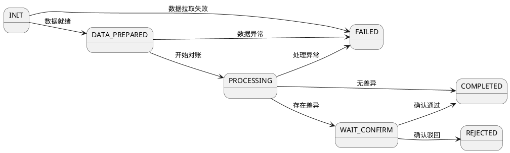

# Feature: F001-recon-task

> 元信息
> - Feature ID: F001-recon-task
> - 优先级: P0
> - 涉及领域: recon（对账）
> - 状态: approved

## 问题定义

平台与渠道之间的交易数据需要对账，当前对账依赖人工导出比对，耗时且易出错。需要一个自动化的对账任务机制，支持定时创建、自动拉取数据、执行对账逻辑、人工确认差异，实现端到端的对账闭环。

## 状态机

**状态说明**:

| 状态 | 含义 | 是否终态 |
|------|------|---------|
| INIT | 初始状态，任务已创建 | 否 |
| DATA_PREPARED | 对账数据已拉取就绪 | 否 |
| PROCESSING | 正在执行对账比对 | 否 |
| WAIT_CONFIRM | 对账存在差异，等待人工确认 | 否 |
| COMPLETED | 对账完成（已确认或无差异） | 是 |
| FAILED | 对账失败（异常终止） | 是 |
| REJECTED | 差异被驳回，需要重新处理 | 是 |

**转换规则**:

| 从 | 到 | 触发条件 | 守卫条件 |
|----|----|---------|---------|
| INIT | DATA_PREPARED | 数据拉取成功 | 数据完整且格式校验通过 |
| INIT | FAILED | 数据拉取失败 | 重试 3 次后仍失败 |
| DATA_PREPARED | PROCESSING | 调用 startRecon | 任务未被取消 |
| DATA_PREPARED | FAILED | 数据校验异常 | 数据存在不可修复的格式错误 |
| PROCESSING | WAIT_CONFIRM | 对账完成且有差异 | 差异记录数 > 0 |
| PROCESSING | COMPLETED | 对账完成且无差异 | 差异记录数 = 0 |
| PROCESSING | FAILED | 处理异常 | 超时或系统异常 |
| WAIT_CONFIRM | COMPLETED | 人工确认通过 | 确认人有权限 |
| WAIT_CONFIRM | REJECTED | 人工驳回 | 确认人有权限 |

## 业务规则

- **BR-001**: 同一商户同一账期（billMonth）只能有一个非终态的对账任务，幂等基于唯一索引 (merchant_id + bill_month + status NOT IN TERMINAL_STATUSES)
- **BR-002**: 对账数据从渠道拉取，每个渠道使用对应的数据提供方（DataProvider），支持策略模式扩展新渠道
- **BR-003**: 对账比对规则：按交易号（transNo）匹配双方数据，金额差异超过 0.01 元记为差异记录
- **BR-004**: 差异记录需人工确认，确认人必须具有 RECON_CONFIRM 角色；驳回后任务进入 REJECTED 状态，需重新发起对账
- **BR-005**: 对账任务超时时间为 30 分钟，从 PROCESSING 状态开始计时，超时自动转为 FAILED
- **BR-006**: 单次对账最多处理 10000 条交易记录，超出部分分批处理
- **BR-007**: 对账完成后触发结算通知，通知下游结算系统该账期可进行结算

## API 契约

### ReconTaskFacade

| 方法 | 请求类型 | 响应类型 | 业务规则 | 错误码 |
|------|---------|---------|---------|--------|
| createReconTask | CreateReconTaskCommand | Result<Long> | BR-001 | RECON_TASK_DUPLICATE |
| startRecon | StartReconCommand | Result<Void> | BR-002, BR-006 | RECON_TASK_STATUS_INVALID, RECON_DATA_PROVIDER_UNAVAILABLE |
| confirmRecon | ConfirmReconCommand | Result<Void> | BR-004 | RECON_NO_PERMISSION, RECON_TASK_STATUS_INVALID |
| queryReconTasks | ReconTaskQuery | Result<Paginator<ReconTaskVO>> | - | - |

### 请求/响应字段

**CreateReconTaskCommand**:
| 字段 | 类型 | 必填 | 校验规则 | 说明 |
|------|------|------|---------|------|
| merchantId | Long | 是 | 非空，正整数 | 商户ID |
| billMonth | String | 是 | 正则 yyyy-MM | 账期 |
| dataProviderCode | String | 是 | 非空，最大32字符 | 数据提供方编码 |

**StartReconCommand**:
| 字段 | 类型 | 必填 | 校验规则 | 说明 |
|------|------|------|---------|------|
| taskId | Long | 是 | 非空，正整数 | 对账任务ID |

**ConfirmReconCommand**:
| 字段 | 类型 | 必填 | 校验规则 | 说明 |
|------|------|------|---------|------|
| taskId | Long | 是 | 非空，正整数 | 对账任务ID |
| approved | Boolean | 是 | 非空 | 是否通过确认 |
| comment | String | 否 | 最大500字符 | 确认/驳回备注 |

**ReconTaskQuery**:
| 字段 | 类型 | 必填 | 校验规则 | 说明 |
|------|------|------|---------|------|
| merchantId | Long | 否 | 正整数 | 商户ID |
| billMonth | String | 否 | 正则 yyyy-MM | 账期 |
| status | String | 否 | 枚举值 | 任务状态 |
| pageNum | Integer | 否 | >=1，默认1 | 页码 |
| pageSize | Integer | 否 | 1-100，默认20 | 每页条数 |

**ReconTaskVO**:
| 字段 | 类型 | 说明 |
|------|------|------|
| id | Long | 主键 |
| merchantId | Long | 商户ID |
| merchantName | String | 商户名称 |
| billMonth | String | 账期 |
| status | String | 任务状态 |
| totalTransCount | Integer | 总交易笔数 |
| matchCount | Integer | 匹配笔数 |
| diffCount | Integer | 差异笔数 |
| gmtCreate | Date | 创建时间 |
| gmtModified | Date | 修改时间 |

### 错误码

| 错误码 | 含义 | 触发条件 |
|--------|------|---------|
| RECON_TASK_DUPLICATE | 重复创建对账任务 | BR-001 |
| RECON_TASK_STATUS_INVALID | 任务状态不允许此操作 | 状态机守卫条件不满足 |
| RECON_DATA_PROVIDER_UNAVAILABLE | 数据提供方不可用 | BR-002 |
| RECON_NO_PERMISSION | 无对账确认权限 | BR-004 |
| RECON_TASK_NOT_FOUND | 对账任务不存在 | taskId 无对应记录 |

## 领域模型

### 聚合根: ReconTask

**身份标识**: id (Long)

**字段**:
| 字段 | 类型 | 说明 | 默认值 |
|------|------|------|--------|
| id | Long | 主键 | - |
| merchantId | Long | 商户ID | - |
| billMonth | String | 账期（yyyy-MM） | - |
| dataProviderCode | String | 数据提供方编码 | - |
| status | ReconTaskStatusEnum | 任务状态 | INIT |
| totalTransCount | Integer | 总交易笔数 | 0 |
| matchCount | Integer | 匹配笔数 | 0 |
| diffCount | Integer | 差异笔数 | 0 |
| confirmUserId | String | 确认人ID | null |
| confirmComment | String | 确认备注 | null |
| gmtCreate | Date | 创建时间 | - |
| gmtModified | Date | 修改时间 | - |

**领域行为**:
| 方法 | 前置条件 | 行为 | 后置条件 |
|------|---------|------|---------|
| prepareData(dataResult) | status == INIT | 校验数据完整性，记录数据条数 | status -> DATA_PREPARED |
| startRecon() | status == DATA_PREPARED | 初始化比对上下文 | status -> PROCESSING |
| recordMatch(count) | status == PROCESSING | 累加匹配笔数 | matchCount += count |
| recordDiff(count, diffRecords) | status == PROCESSING | 累加差异笔数，保存差异记录 | diffCount += count |
| completeWithMatch() | status == PROCESSING && diffCount == 0 | 无差异直接完成 | status -> COMPLETED |
| waitConfirm() | status == PROCESSING && diffCount > 0 | 暂停等待人工确认 | status -> WAIT_CONFIRM |
| confirm(userId, approved, comment) | status == WAIT_CONFIRM | 确认人对账结果 | approved ? status -> COMPLETED : status -> REJECTED |
| fail(reason) | status IN (INIT, DATA_PREPARED, PROCESSING) | 记录失败原因，终止任务 | status -> FAILED |
| isTimeout(timeoutMinutes) | status == PROCESSING | 判断是否超时 | return gmtModified + timeoutMinutes < now |

### 枚举: ReconTaskStatusEnum

| 枚举值 | code | 含义 | 是否终态 |
|--------|------|------|---------|
| INIT | INIT | 初始 | 否 |
| DATA_PREPARED | DATA_PREPARED | 数据就绪 | 否 |
| PROCESSING | PROCESSING | 对账中 | 否 |
| WAIT_CONFIRM | WAIT_CONFIRM | 等待确认 | 否 |
| COMPLETED | COMPLETED | 已完成 | 是 |
| FAILED | FAILED | 已失败 | 是 |
| REJECTED | REJECTED | 已驳回 | 是 |

### 领域服务: ReconDomainService

| 方法 | 职责 |
|------|------|
| executeRecon(reconTask, platformData, channelData) | 执行对账比对逻辑（按 transNo 匹配，比对金额） |
| checkAndFailTimeout(reconTask) | 检查超时并标记失败 |
| notifySettlement(reconTask) | 对账完成后通知结算系统 |

### 仓储接口: ReconTaskRepository

| 方法 | 说明 |
|------|------|
| save(reconTask) | 保存/更新 |
| findById(id) | 按ID查询 |
| findByMerchantAndBillMonth(merchantId, billMonth) | 按商户和账期查询 |
| findByCondition(query) | 条件分页查询 |
| existsActiveTask(merchantId, billMonth) | 是否存在活跃任务（非终态） |

## Schema 变更

### 新增表: recon_task

| 字段 | 类型 | 约束 | 说明 |
|------|------|------|------|
| id | BIGINT | PK, AUTO_INCREMENT | 主键 |
| merchant_id | BIGINT | NOT NULL | 商户ID |
| bill_month | VARCHAR(7) | NOT NULL | 账期 yyyy-MM |
| data_provider_code | VARCHAR(32) | NOT NULL | 数据提供方编码 |
| status | VARCHAR(20) | NOT NULL, DEFAULT 'INIT' | 任务状态 |
| total_trans_count | INT | NOT NULL, DEFAULT 0 | 总交易笔数 |
| match_count | INT | NOT NULL, DEFAULT 0 | 匹配笔数 |
| diff_count | INT | NOT NULL, DEFAULT 0 | 差异笔数 |
| confirm_user_id | VARCHAR(64) | NULL | 确认人ID |
| confirm_comment | VARCHAR(500) | NULL | 确认备注 |
| fail_reason | VARCHAR(500) | NULL | 失败原因 |
| gmt_create | DATETIME | NOT NULL | 创建时间 |
| gmt_modified | DATETIME | NOT NULL | 修改时间 |

**索引**:
- uk_merchant_bill_status: UNIQUE (merchant_id, bill_month) — WHERE status NOT IN ('COMPLETED', 'FAILED', 'REJECTED')
  > 注：MySQL 不支持条件唯一索引，通过应用层 BR-001 保证幂等

### 新增表: recon_diff_record

| 字段 | 类型 | 约束 | 说明 |
|------|------|------|------|
| id | BIGINT | PK, AUTO_INCREMENT | 主键 |
| task_id | BIGINT | NOT NULL, FK → recon_task.id | 对账任务ID |
| trans_no | VARCHAR(64) | NOT NULL | 交易号 |
| platform_amount | DECIMAL(18,2) | NOT NULL | 平台金额 |
| channel_amount | DECIMAL(18,2) | NOT NULL | 渠道金额 |
| diff_type | VARCHAR(20) | NOT NULL | 差异类型：AMOUNT_DIFF/MISSING_PLATFORM/MISSING_CHANNEL |
| dealt | TINYINT | NOT NULL, DEFAULT 0 | 是否已处理 |
| gmt_create | DATETIME | NOT NULL | 创建时间 |

**索引**:
- idx_task_id: (task_id)
- idx_trans_no: (trans_no)

## 兼容性约束

- createReconTask、startRecon、confirmRecon、queryReconTasks 均为新增接口，不影响现有 API
- recon_task 和 recon_diff_record 为新增表，不影响现有数据
- 数据提供方（DataProvider）使用策略模式，新增渠道只需新增实现类，不影响已有渠道逻辑
- 确认权限（RECON_CONFIRM 角色）需在权限系统中新增，不影响已有角色
- 对账完成后通知结算系统为新增集成点，需与结算团队协调接口协议

## 验收条件

- [ ] 创建对账任务：同一商户同一账期不可重复创建 INIT 状态的任务（BR-001）
- [ ] 状态机完整转换：INIT → DATA_PREPARED → PROCESSING → WAIT_CONFIRM → COMPLETED/REJECTED 及各失败路径均可正确流转
- [ ] 对账比对逻辑：按 transNo 匹配，金额差异超过 0.01 元生成差异记录（BR-003）
- [ ] 人工确认：仅具有 RECON_CONFIRM 角色的用户可执行确认/驳回操作（BR-004）
- [ ] 超时处理：PROCESSING 状态超过 30 分钟自动转为 FAILED（BR-005）
- [ ] 批量限制：单次对账最多处理 10000 条记录，超出部分分批（BR-006）
- [ ] 查询接口：分页查询，pageSize 上限 100，返回商户名称等关联信息
- [ ] API 返回值均使用 Result<T> 包装，错误码符合 {MODULE}_{BUSINESS}_{ERROR_DESC} 格式

---

<!-- 以下为 AI 内部使用，不在人工审查范围内 -->
## AI 上下文指引

- 技术栈: Java Spring Boot DDD
- 参考实现: 无（新领域）
- 依赖的 standards: standards/java-ddd/standards.md
- 依赖的 patterns: standards/java-ddd/patterns/（entity.md, facade.md, repository.md）